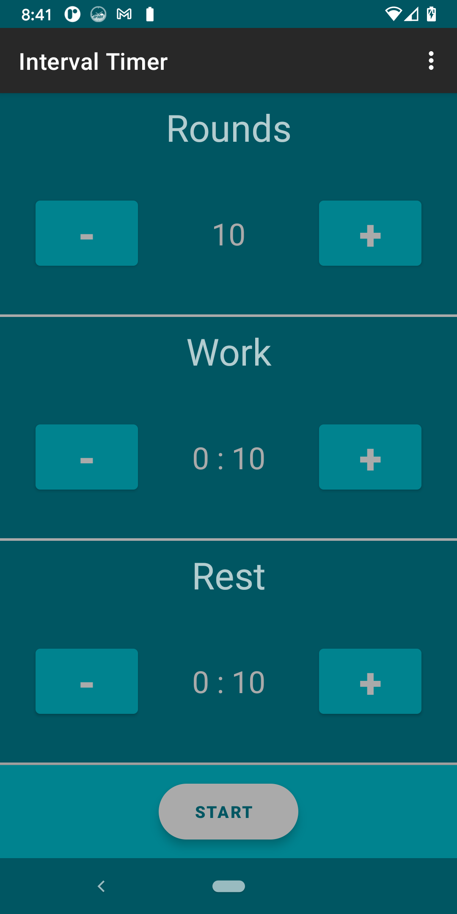

# Workout Interval Timer App

##Features:
* User can set how many rounds of workouts they want, how many minutes each workout is, and how long their rest time is.

* Press Start to begin the interval training timer.

Thank you to Professor Samuel Abrahamson for his guidance.
Thank you to this [IntervalTimer app] (https://github.com/iccaka/IntervalTimer) that was a great resource 
to us.
